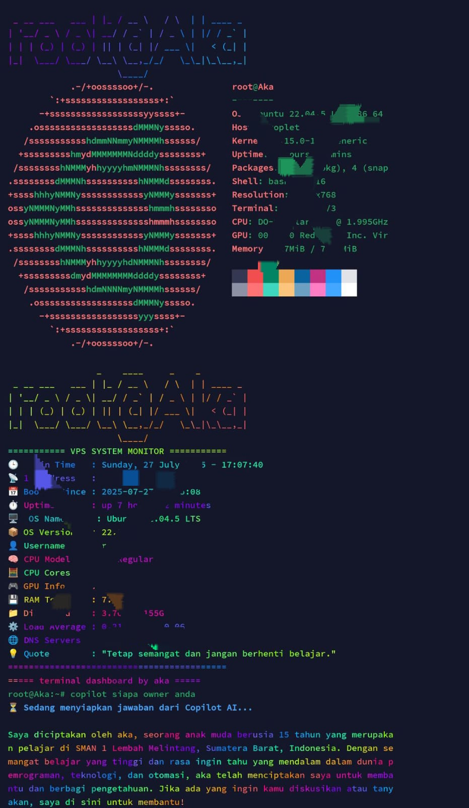

# 🖥️ DashTerm - Terminal Prompt AI Keren

DashTerm adalah sebuah proyek terminal prompt cerdas yang mengubah tampilan dan fungsi terminal Linux kamu menjadi lebih interaktif dan informatif. Dilengkapi dengan AI Prompt yang ditanam langsung di terminal, DashTerm cocok untuk developer, sysadmin, pelajar, dan siapa saja yang ingin terminalnya lebih canggih!

---



---

## 🚀 Cara Instalasi Cepat

Cukup jalankan perintah ini di terminal Anda:

```bash
bash <(curl -s https://raw.githubusercontent.com/akaanakbaik/dashterm/main/install.sh)
```

---

## 📋 Fitur Utama

- ✅ Prompt terminal dengan sentuhan AI  
- ✅ Identitas user & sistem tampil keren  
- ✅ Informasi waktu real-time  
- ✅ Menampilkan kutipan motivasi atau sistem AI lainnya  
- ✅ Sangat ringan, cocok untuk VPS, Termux, ataupun server lokal  

---

## 🛠️ Langkah-langkah Instalasi Manual

> *Catatan: Jika Anda sudah menggunakan perintah otomatis di atas, Anda bisa **melewati Langkah 2** dan lanjut ke Langkah 3.*

### Langkah 1: Unduh dan jalankan installer

```bash
bash <(curl -s https://raw.githubusercontent.com/akaanakbaik/dashterm/main/install.sh)
```

### Langkah 2: *(Langkah ini dilewati)*

> Langkah ini tidak diperlukan karena semua proses dilakukan otomatis saat install.

Namun jika Anda ingin mengedit prompt AI secara manual, jalankan:

```bash
nano ~/.bashrc
```

Scroll ke bawah dan ubah bagian prompt sesuai keinginan Anda.

### Langkah 3: Jalankan ulang konfigurasi

Setelah proses instalasi selesai, script akan otomatis menjalankan:

```bash
clear && source ~/.bashrc
```

Hal ini agar perubahan langsung terlihat tanpa perlu keluar masuk terminal.

---


## 🤖 Cara menggunakan fitur AI
harus dengan awalan copilot buat teks perintah/promt untuk AI di terminal nya
```promt
copilot hai ai
```
## 📌 Catatan Tambahan

- Script ini aman untuk digunakan di server pribadi maupun publik.
- Tidak menyentuh atau merusak konfigurasi lainnya.
- Cocok digunakan di distribusi Ubuntu, Debian, dan turunan lainnya.

---

## 🤝 Kontribusi

Jika Anda ingin berkontribusi, silakan fork repository ini dan ajukan pull request.

---

## 👨‍💻 Pembuat

Proyek ini dibuat oleh **Aka** — seorang pelajar Indonesia yang penuh semangat dalam dunia otomasi dan AI.

GitHub: [https://github.com/akaanakbaik](https://github.com/akaanakbaik)

---

## ❤️ Lisensi

Proyek ini dirilis dengan lisensi MIT. Bebas digunakan, dimodifikasi, dan didistribusikan.
